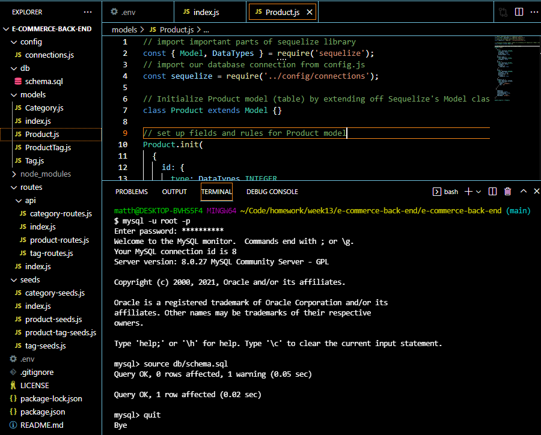
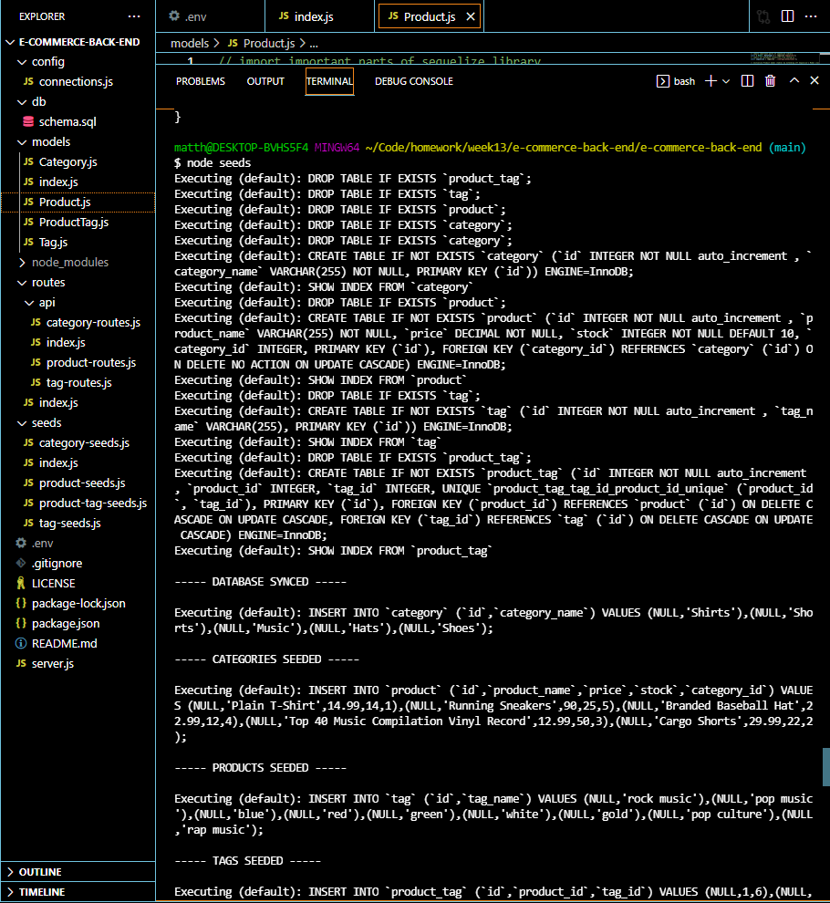
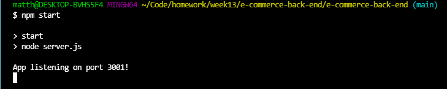
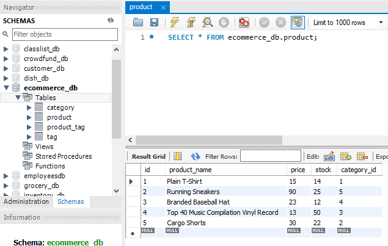

# Object Relational Mapping: E-Commerce-Back-End

    
    
    
    
    

## Description
The code for the backend of an ecommerce shop will be published as part of this project. It explains how to build up your database as well as how to use pre-made routes. It lacks a front end, so you'll need to utilize the Insomnia app to thoroughly evaluate your data.

- [Live Link to Demo]()

## Visuals

## Repository

  - [Project Repo](https://github.com/Matthewwalker333/e-commerce-back-end)

## Questions
*For any additional information find me at* 

GitHub: [@Matthewwalker333](https://github.com/Matthewwalker333/)

Email: [matthewwalkermw64@gmail.com](mailto:matthewwalkermw64@gmail.com)

